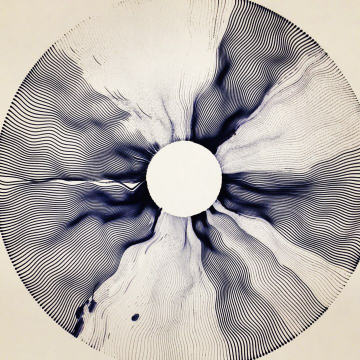
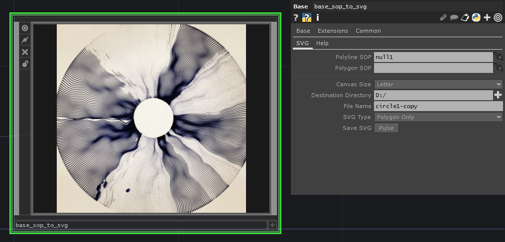
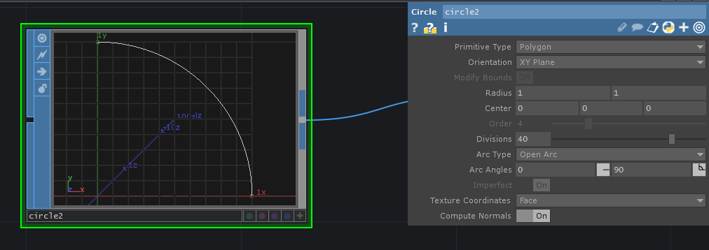
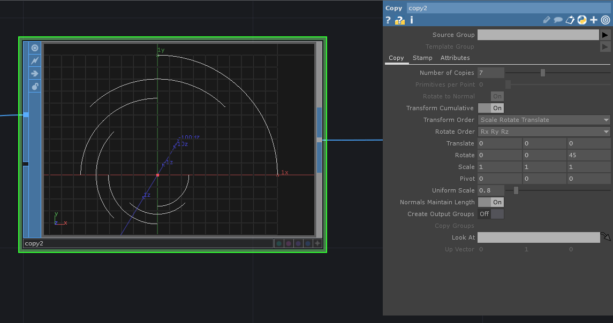
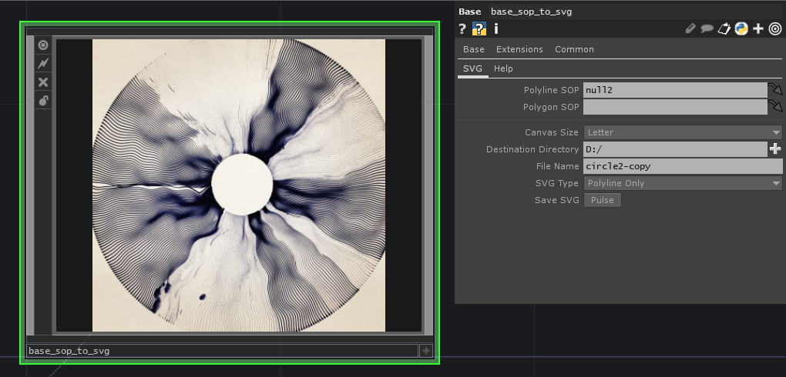

# touchdesigner-sop-to-svg
### Matthew Ragan ###
_[matthewragan.com](http://matthewragan.com)_  
A pipeline for handling the SOP to SVG pipeline. This is especially handy for using procedurally generated geometry for paths to be cut or plotted.

# Dependencies
**TouchDesigner 099** - https://www.derivative.ca/099/Downloads/
This tox is written and maintained in 099.

**SVG Write** - https://pypi.python.org/pypi/svgwrite/
This tox requires the Python library SVG Write to function correctly. If you're familiar with adding external Python libraries in Touch please carry on. If that's a new process to you, I'd recommend that you read through the python documentation on the derivative wiki: https://www.derivative.ca/wiki099/index.php?title=Introduction_to_Python_Tutorial

# Overview
Scalable Vector Graphics (SVG) are a handy means of creating images that aren't bound by the rules of raster graphics. Illustrators and designers often use SVGs for a variety of purposes, but they're especially interesting when it comes to interacting with plotting and cutting machinery. Laser and vinyl cutters, plotters and all manner of other devices can use SVGs rather than raster based graphics.

Derivative's TouchDesigner is well known for working with raster based graphics, but there's little support for capturing and outputting SVGs as a built in approach. It does, however, support a robust python layer which is capable of handling this task. The primary design in this TouchDesigner module is to target the process of converting Surface Operators (SOPs) to SVGs so they can be plotted or laser cut.

To that end in this TOX you'll find several means of capturing and plotting your geometry.

# Feature and Parameters
Not all geometry is created equal, and while it's lovely to imagine that there might be a single perfect way to handle drawing all shapes, but alas it's a little more dicey than that when plotting lines. A large concern here is the need to be able to draw closed shapes, open shapes, and images that have both closed and open shapes. 

This is addressed through a set of custom parameters and a python extension. The python extension can be found inside of the base_sop_to_svg tox as svgEXT. If Python is in your wheelhouse, take a look inside the tox as the methods and members are documented inside of this extension. 

Parameter | Description and Function
---|---
Polyline SOP | This parameter accepts a SOP and should be a group of any primitives you'd like to have drawn as open polylines. Important to note, the extension will draw each primitive in your SOP as its own open shaped polyline. 
PolygonSOP | This parameter accepts a SOP and should be a group of any primitives you'd like to have drawn as closed polygons. Important to note, the extension will draw each primitive in your SOP as its own closed shape polygon. 
Canvas Size | The axidraw (my primary plotting device) supports two different canvas sizes: Letter and A4. Using this parameter will help ensure that your svg is correctly set up to export at dimensions that are friendly to inkscape for plotting right away without needing additional document setup.
Destination Directory | This should be a path to your desired directory location for your file. It's important to note that TouchDesigner has an undesirable legacy feature that uses a built in variable $TOUCH that represents the location of your project file. Using this variable will result in an error at save. To avoid this, make sure that your save destination is not the same as where your project is saved. If you're using an un-saved project, this typically defaults to the desktop - in this case, save to a destination other than your desktop. 
File Name | The string name for your file. The file extension .svg will be added to your saved file - you do not need to include this.
SVG Type | Here you can choose to save an SVG that's comprised of polygons and polylines, only polylines, or only polygons. Use the appropriate menu selection to match your intended output. 
Save SVG | Click to save to file.
Use Camera | Toggle on to use perspective camera, Toggle off for orthographic rendering.
Aspect | The aspect ratio for the final output. Not really used.  
 
# Using the TOX
Let's look at a simple use case where we want to draw both closed and open shapes.

### Drawing Closed Shapes
Let's use a circle SOP set to 3 divisions.

Next we'll use a copy SOP to make 7 copies. Let's set the rz parameter to 8, and the uniform scale parameter to 0.8.

Let's connect this to a null SOP, and then drag and drop the null SOP onto the Polygon SOP parameter. Select a canvas size, destination directory, and name your file. Make sure to select the Polygon only SVG Type, and click save.

Congratulations, you've made your first SVG out of SOPs.

### Drawing Open Shapes
Let's start with a circle SOP with 40 divisions. Let's make sure our arc type is set to open, and our arc angles are set to 90.

Next let's connect a copy SOP to make 7 copies. This time let's change our rz par to 45, and our uniform scale to 0.8. 

Connect your copy SOP to a null SOP, now drag and drop your null onto the Polyline SOP parameter. Select a canvas size, destination directory, and name your file. Make sure to select the Polygon only SVG Type, and click save.

Congratulations, you've made your second SVG out of SOPs.

[plot1]:https://instagram.fsnc1-1.fna.fbcdn.net/t51.2885-15/e35/21480091_1766025503697997_8211273022301011968_n.jpg
[circle3div]:https://github.com/raganmd/touchdesigner-sop-to-svg/blob/master/assets/circle.PNG
[copyCircle]:https://github.com/raganmd/touchdesigner-sop-to-svg/blob/master/assets/copy1.PNG
[polygonSettings]:https://github.com/raganmd/touchdesigner-sop-to-svg/blob/master/assets/copy1-svg-settings.PNG?raw=true
[circle-openarc]:https://github.com/raganmd/touchdesigner-sop-to-svg/blob/master/assets/circle-openarc.PNG
[copyCircle2]:https://github.com/raganmd/touchdesigner-sop-to-svg/blob/master/assets/copy2.PNG
[polylineSettings]:https://github.com/raganmd/touchdesigner-sop-to-svg/blob/master/assets/copy2-svg-settings.PNG